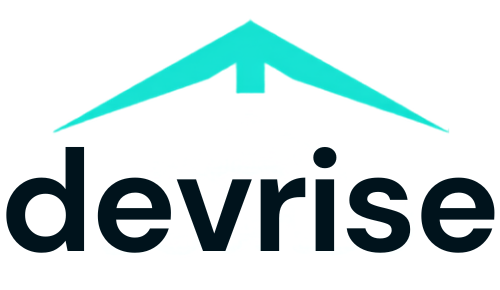

<p align="center">
  
</p>

<h1 align="center">DevRise</h1>

<p align="center">
  <strong>Learn. Build. Rise.</strong><br/>
  Virtual Internships for Aspiring Developers
</p>

<p align="center">
  <a href="https://stuxxnett.github.io/devrise">
    
  </a>
  
</p>

---

## 🚀 About

**DevRise** is a platform that bridges the gap between academic learning and industry requirements. We offer structured, project-based virtual internships that give students real-world experience, help them build a professional portfolio, and earn verifiable certificates.

## ✨ Features

- 🎨 **Modern Glassmorphism UI** — Sleek dark/light theme with smooth transitions
- 📱 **Fully Responsive** — Optimized for desktop, tablet, and mobile devices
- 🌗 **Dark / Light Mode** — User-preferred theme with localStorage persistence
- 🎓 **Internship Tracks** — Java Development, Web Development, and AI/ML programs
- 🔍 **Certificate Verification** — Validate intern credentials via unique Certificate IDs
- 📬 **Contact Form** — Built-in messaging with toast notifications
- ❓ **FAQ Accordion** — Interactive, animated FAQ section
- 🔒 **Privacy & Terms Modals** — Policy information presented in accessible modals

## 🛠️ Tech Stack

| Layer     | Technology                          |
| --------- | ----------------------------------- |
| Structure | HTML5 (Semantic)                    |
| Styling   | Vanilla CSS (Custom Properties, Glassmorphism, Animations) |
| Logic     | Vanilla JavaScript (ES6+)           |
| Icons     | Font Awesome 6                      |
| Fonts     | Google Fonts — Inter, Outfit        |

## 📂 Project Structure

```
devrise/
├── index.html      # Main HTML page with all sections & modals
├── style.css       # Complete design system & responsive styles
├── script.js       # Theme toggle, nav, verification, modals, forms
├── logo.png        # DevRise brand logo
└── README.md       # You are here
```

## 🏁 Getting Started

No build tools or dependencies required — just open the site:

```bash
# Clone the repository
git clone https://github.com/stuxxnett/devrise.git

# Open in browser
cd devrise
start index.html        # Windows
open index.html         # macOS
xdg-open index.html     # Linux
```

Or use a local dev server:

```bash
# Using Python
python -m http.server 8000

# Using Node.js (npx)
npx serve .
```

## 🔍 Certificate Verification

Test the verification system with these sample IDs:

| Certificate ID | Intern Name    | Program                      |
| -------------- | -------------- | ---------------------------- |
| `DVR-2026-001` | Rahul Sharma   | Java Development Internship  |
| `DVR-2026-002` | Priya Patel    | Web Development Internship   |
| `DVR-2026-003` | Aarav Mehta    | AI / ML Internship           |

## 📸 Preview

### Dark Mode
> Sleek dark interface with purple/teal accent gradients and glassmorphic cards.

### Light Mode
> Clean light theme with adjusted contrast and accessible color palette.

## 📧 Contact

- **Email:** [info.devrise@gmail.com](mailto:info.devrise@gmail.com)
- **LinkedIn:** [linkedin.com/company/devrise26](https://linkedin.com/company/devrise26)

---

<p align="center">
  <sub>© 2026 DevRise. All rights reserved.</sub>
</p>
